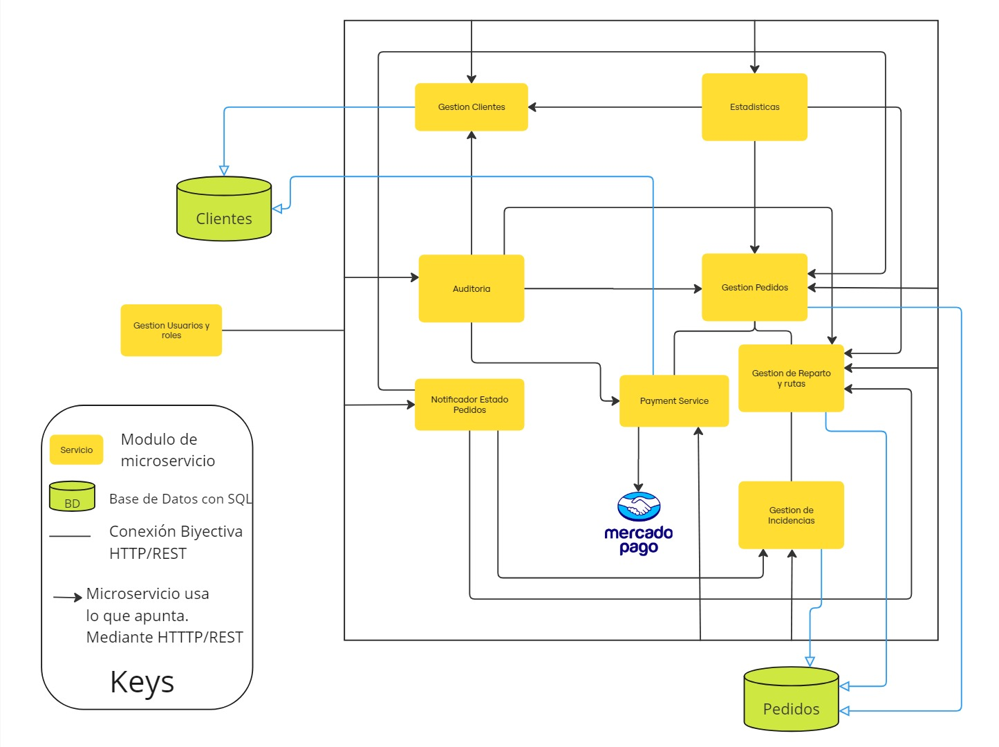

- **Diagrama General de Microservicios**: El siguiente diagrama representa la propuesta inicial de la arquitectura del sistema, mostrando una vista genérica en ejecución que destaca los servicios principales, las bases de datos asociadas y las relaciones de comunicación entre ellos mediante conexiones HTTP/REST. 