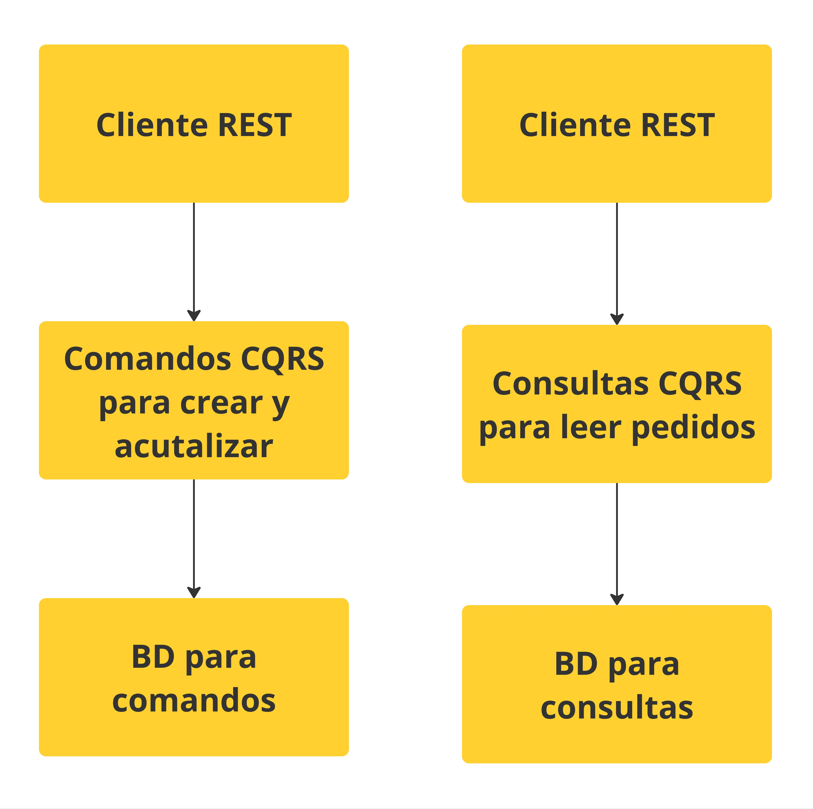
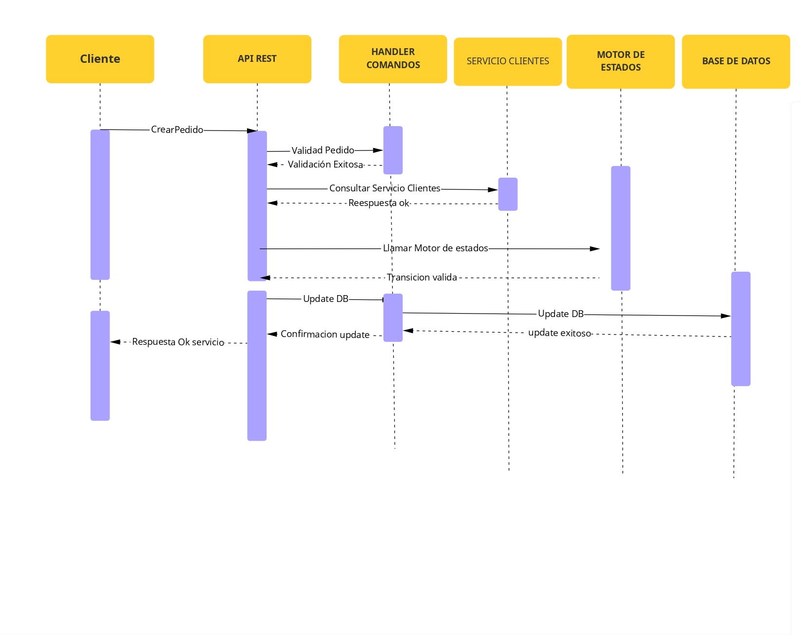

- **Diagrama de componentes de la Base de Datos**: El siguiente diagrama representa la propuesta sobre como manejar la base de datos con la utilización de CQRS 

- **Diagrama de Secuencia de Gestion de Pedido** El siguiente diagrama corresponde a como será el comportamiento cuando un cliente solicita crear un nuevo pedido. 