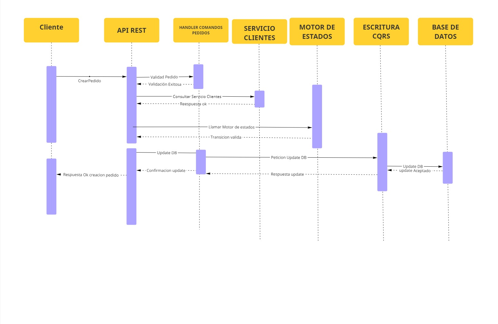
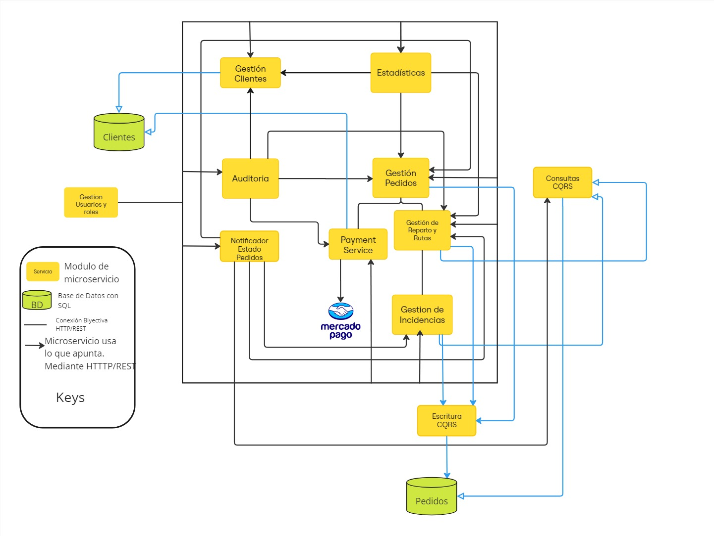
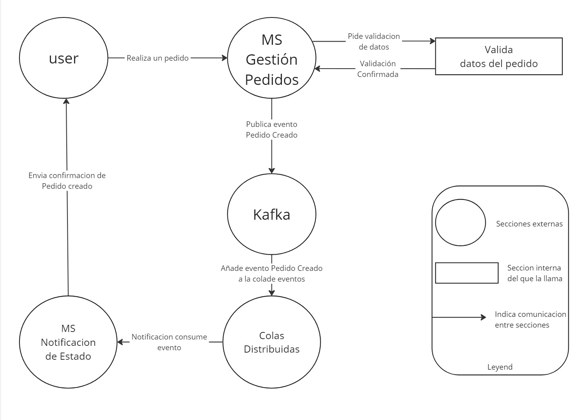

- **Diagrama de Secuencias**: El siguiente diagrama representa la interaccion entre los microservicios cuando el cliente hace una solicitud de creación de Pedidos. 

- **Diagrama General Versión 2**: Este diagrama es una version dos del diagrama generado en la iteracion uno, en donde se incluyo el uso de patrones CQRS para consultas y escritura en bases de datos.

- **Diagrama de Flujo de Procesos de Pedido**: Este diagrama describe el flujo de comunicación entre los diferentes componentes involucrados en la gestión de pedidos. Un usuario realiza un pedido, el cual es gestionado por un microservicio encargado de validarlo. Una vez validado, se publica un evento en Kafka, que es procesado por colas distribuidas. Finalmente, otro microservicio consume el evento para notificar al usuario sobre el estado del pedido. 
