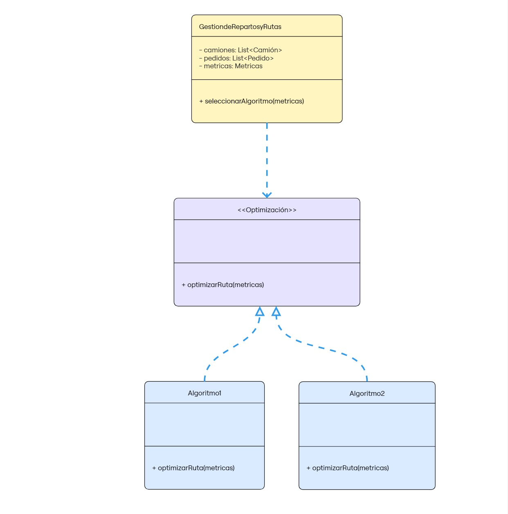
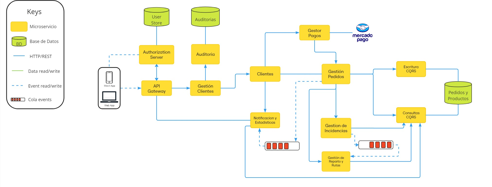

- **Diagrama de Clases**: El siguiente diagrama representa el como esta construida la nueva interfaz con dos clases que implementan un algoritmo particular y muestra como la Gestion de reparto y rutas la utiliza 

- **Diagrama General Versión 4**: Este diagrama es una version cuatro del diagrama generado en la iteracion cero, uno y dos, en donde se incluyo el uso de colas de evento para la comunicacion entre microservicios y tener siempre actualizado el sistema
