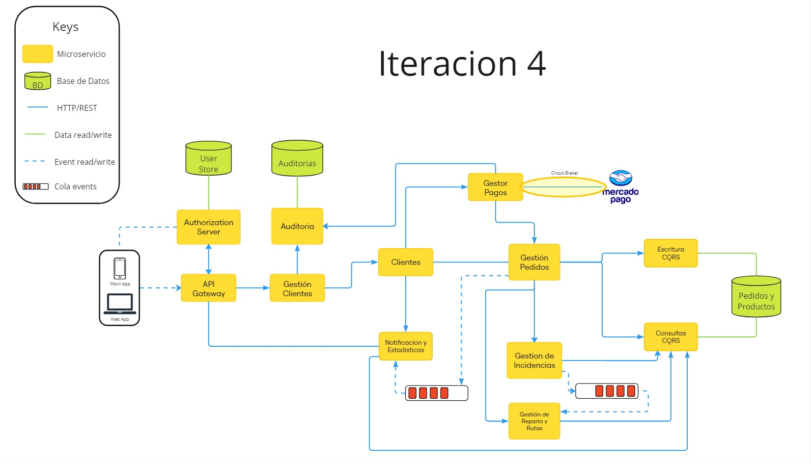

- **Diagrama General Versión 5**: Este diagrama es una version cinco del diagrama generado en las iteraciones anteriores en donde se incluyo el uso del patron Circuit Braker en Gestor Pagos cuando se comunica con Mercado Pago y una conexion entre Gestor de Pago y Auditoria